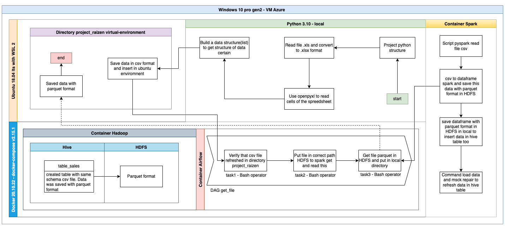

# projeto Raízen 

## por Ramon Barbosa de Freitas ##

## TL,DR ##
Criação de pipeline de dados com intuito de obter dados de uma planilha com muitas informações distintas e disponibilizar em formato colunar parquet.

## Detalhamento do processo de desenvolvimento do ambiente ##

- Criação de uma máquina virtual Azure com imagem de windows 10
- Configurações de ambiente linux no windows
- Download e configuração do Ubuntu 18.04
- Instalação do Python 3.10 no ambiente windows e em ambiente linux Ubuntu
- Instalação e configuração do Docker v20.10.22 com docker-compose v2.15.1
- Configuração do container Hadoop(incluindo a imagem do Spark) no Docker
- Configuração do container AirFlow 2.3.1
- Configuração de variáveis de ambiente para o airflow(AIRFLOW_HOME)
- Instalação de bibliotecas Python utilizadas do ecossistema tais como: pandas, xlrd, openpyxl, xlsxwrite
- Instalação do Git no windows
- Instalação do LibreOffice
- Instalação do Java JDK e Pyspark no Ubuntu para testes locais no airflow Docker

## Arquitetura do projeto ##

## Resumo da arquitetura ##

O ecossistema todo se dá em uma máquina virtual Azure com imagem do windows 10 e Python configurado. Nesta maquina há sub-ecossistemas, a saber, o Ubuntu 18.04 que contém o diretório projeto_raizen com permissão de escrita e leitura abertos a máquina, o Docker que contempla os containers Hadoop com Spark e AirFlow.

Inicialmente, o dado é adquirido de uma API que nos fornece o arquivo .xls com os dados que deverão ser extraidos. Com um projeto Python local usando a versão 3.10, este arquivo é convertido para formato .xlsx utilizando o pandas e xlrd. Utilizando a lib openpyxl extraimos os dados de derivative e diesel e estes dados são salvos no formato csv e inseridos no ecossistema Ubuntu.

Em seguida, com o Apache AirFlow, através de uma DAG com a tarefa de operator Bash verificamos a existencia do dado na pasta de fornecimento deste arquivo.
a segunda tarefa do airflow é executar o script Pyspark, onde é lido o arquivo csv, convertido para dataframe spark e salvo no diretório da tabela tbl_derivative e tbl_diesel com seus respectivos dados. O arquivo parquet é também encaminhado para o diretório local no Ubuntu para acesso do usuário.

Finalizando, o arquivo em planilha é disponibilizado em formato csv e em seguida salvo como formato colunar parquet tanto na pasta das tabelas no Hive quanto no diretório do projeto na Ubuntu.

## Pontos que não deram tempo de finalizar ##
- ELaboração do código do airflow(apenas foi versionado um código teste inicial)
- Comandos Spark que gerariam os arquivos parquet após a leitura do arquivo csv, ja disponibilizado
- Conexão entre o servidor ubuntu e o servidor do Docker pra input de arquivos no HDFS do Docker
